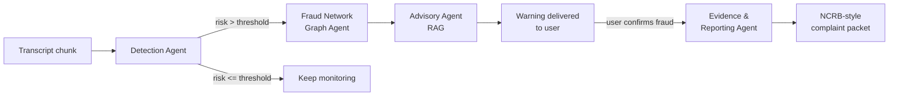

# AntiScam AI

**Real-time interception of conversational fraud — before the money moves.**

Built for **ET AI Hackathon 2026** · *AI for Digital Public Safety: Defeating
Counterfeiting, Fraud & Digital Arrest Scams*

---

## The problem

India recorded **1.14 million cybercrime complaints in 2023**. "Digital arrest"
scams — where fraudsters impersonate CBI/ED/Customs officers over video call and
psychologically coerce victims into transferring money — took **over ₹1,776 crore
in the first nine months of 2024 alone**.

Existing tools are forensic: they help *after* the complaint is filed, when the
money is already gone. There is no intelligence layer operating **during** the
call, at the moment coercion is actually happening.

AntiScam AI is that layer.

## What it does

1. **Monitors** a call/chat transcript as it unfolds, scoring scam risk continuously
2. **Cross-references** scammer identifiers (phone / UPI / account / claimed officer)
   against a fraud network graph to detect a **repeat scammer already victimising others**
3. **Warns** the target in plain language, citing the relevant MHA/RBI advisory
4. **Drafts** a structured NCRB-style complaint if the target confirms fraud

The differentiator is #2: most detectors judge one conversation in isolation.
This one builds **cross-victim intelligence**.

## Architecture



Orchestrated with **LangGraph**. Four agents:

| Agent | Role | Status |
|---|---|---|
| **Scam Pattern Detection** | Scores risk from language & dialogue dynamics | ✅ Verified |
| **Fraud Network Graph** | Links entities across sessions (NetworkX) | ✅ Verified |
| **Advisory (RAG)** | Regulation-backed warning, EN/HI/TA (ChromaDB) | ✅ Verified |
| **Evidence & Reporting** | Structured complaint packet | ✅ Verified |

Routing is conditional, not "run everything": most monitored calls are ordinary,
and the graph/advisory/reporting agents only carry meaning once risk is real.
A benign call costs one detection and stops.

### The Detection Agent is two layers, fused

```
transcript ─┬─> deterministic tripwires ──> rule_score ─┐
            │      microseconds, offline               ├─> fused score
            └─> Groq LLM (llama-3.3-70b) ──> llm_score ─┘
                     ~2s, JSON mode
```

The LLM is the primary judge (75%); the rule layer is a minority vote that anchors
non-negotiable signals. This is not redundancy for its own sake — it buys
**explainability** (a public-safety tool must justify itself), **drift protection**,
and **graceful degradation**: with Groq's quota fully exhausted, a real digital-arrest
transcript still scored **94/100 in 467ms** and correctly extracted the mule account.

### Cross-victim intelligence, concretely

The fraud graph is bipartite: sessions link to the identifiers seen in them, so two
sessions sharing an identifier sit at distance 2 and a connected component *is* a
fraud operation. Running a live call that quotes a known mule account produces:

```
REPEAT SCAMMER. The bank account 50100294471882 in this call has already been
recorded against 2 other victims. Through other shared identifiers, this caller
is linked to 3 victims in total.
```

We link **only** on identifiers that actually implicate a shared operator — phone,
UPI, account, case number, URL. Never on "CBI" or "Inspector Sharma": thousands of
unrelated scammers claim both, and linking on those would collapse the dataset into
one meaningless cluster and name innocent people. That guard is enforced by tests.

## Status

| Phase | Scope | Status |
|---|---|---|
| **1** | Detection Agent, `/api/classify`, dataset generator, tests | ✅ Verified |
| **2** | LangGraph orchestration, fraud graph, RAG advisory, reporting | ✅ Verified |
| **3** | React dashboard: live session monitor + fraud network view | ✅ Verified |
| **4** | Metrics harness, curated eval set, deployment configs | ✅ Built |

**Verified:** 84 offline tests passing · detection latency **1.8–2.5s** ·
obvious scam → 98, obvious legitimate → 6 · full pipeline
(`detect → graph → advisory → report`) runs end-to-end · dashboard renders and
drives the live backend.

## Metrics

The evaluation harness (`backend/scripts/evaluate.py`) computes precision, recall,
F1, false-positive rate (reported separately on **hard negatives**), per-scam-type
recall, and detection lead time, against a labeled set.

Because a benchmark's value is trustworthy labels, evaluation runs on a **hand-curated**
16-transcript set (`scripts/build_curated_dataset.py`) — every scam type, plus 5 hard
negatives (a genuine bank fraud alert, a real delivery OTP, an overdue-EMI reminder)
that a naive detector would false-positive on. It needs no API key, so anyone can
reproduce it.

**Rule-layer floor (LLM unavailable), verified:**

| Metric | Value |
|---|---|
| Precision | **1.0** |
| False-positive rate | **0.0** |
| Hard-negative FPR | **0.0** |
| Recall | 0.5 |

The rule layer alone never false-positives — even on calls built to fool it — but
misses subtler scams (loan, job, investment) that have no hard keyword signature.
**That gap is the argument for the LLM layer**, which lifts recall on exactly those
cases. Full-detector figures (rules + LLM) need Groq quota beyond the free-tier
daily cap; run `evaluate.py` with a key configured, then `write_metrics_report.py`.

> The 60-sample LLM-generated set from the original plan is superseded by the curated
> set for benchmarking (trustworthy labels, zero cost). The generator still exists
> (`scripts/generate_dataset.py`, verified on a real sample) for augmentation on Dev Tier.

## Deployment

- **Backend** → Render (`render.yaml` blueprint) or any container host
  (`backend/Dockerfile`, verified to build cleanly). Cloud Run works with the same
  image. Set `GROQ_API_KEY` in the host's env — never commit it.
- **Frontend** → Vercel (`frontend/vercel.json`). Set `VITE_API_BASE` to the
  deployed backend URL at build time.

Both run in **degraded mode with no key**, so the dashboard is demoable without
spending any Groq quota.

## Quick start

```bash
cd backend
python -m venv venv && venv\Scripts\activate    # Windows
pip install -r requirements.txt
copy .env.example .env                          # add your GROQ_API_KEY
uvicorn app.main:app --reload
```

Full setup, architecture rationale, and API docs: **[backend/README.md](backend/README.md)**

Get a Groq key at [console.groq.com/keys](https://console.groq.com/keys).
Note the free tier caps at **100k tokens/day (~25 detection calls)** — see the
backend README for the measured token budget.

## Known limitations

- **Synthetic data only.** No real call transcripts; metrics measure behaviour on
  machine-generated dialogue, which is cleaner than reality.
- **Regulatory/legal content is illustrative.** Advisory and IPC/IT Act references
  are representative content for a prototype, **not verified legal advice**.
- **No live telecom integration.** Transcripts are replayed, not tapped.
- **English-dominant**, with common Hindi/Hinglish transliterations covered.
- **Rule lexicon is hand-built**, so it misses novel phrasings by construction —
  which is exactly why it is a minority vote, not the primary judge.

## Security

No API keys are hardcoded anywhere. All secrets load from `.env`, which is
gitignored. See `backend/.env.example` for required variables.