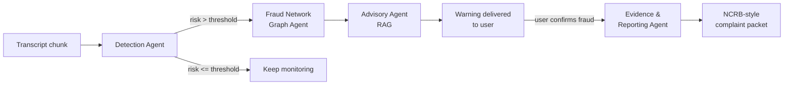

# AntiScam AI

**Real-time interception of conversational fraud — before the money moves.**

Built for **ET AI Hackathon 2026** · *AI for Digital Public Safety: Defeating
Counterfeiting, Fraud & Digital Arrest Scams*

---

## The problem

India recorded **1.14 million cybercrime complaints in 2023**. "Digital arrest"
scams — where fraudsters impersonate CBI/ED/Customs officers over video call and
psychologically coerce victims into transferring money — took **over ₹1,776 crore
in the first nine months of 2024 alone**.

Existing tools are forensic: they help *after* the complaint is filed, when the
money is already gone. There is no intelligence layer operating **during** the
call, at the moment coercion is actually happening.

AntiScam AI is that layer.

## What it does

1. **Monitors** a call/chat transcript as it unfolds, scoring scam risk continuously
2. **Cross-references** scammer identifiers (phone / UPI / account / claimed officer)
   against a fraud network graph to detect a **repeat scammer already victimising others**
3. **Warns** the target in plain language, citing the relevant MHA/RBI advisory
4. **Drafts** a structured NCRB-style complaint if the target confirms fraud

The differentiator is #2: most detectors judge one conversation in isolation.
This one builds **cross-victim intelligence**.

## Architecture



Orchestrated with **LangGraph**. Four agents:

| Agent | Role | Status |
|---|---|---|
| **Scam Pattern Detection** | Scores risk from language & dialogue dynamics | ✅ Phase 1 |
| **Fraud Network Graph** | Links entities across sessions (NetworkX) | Phase 2 |
| **Advisory (RAG)** | Regulation-backed warning, EN/HI/TA (ChromaDB) | Phase 2 |
| **Evidence & Reporting** | Structured complaint packet | Phase 2 |

### The Detection Agent is two layers, fused

```
transcript ─┬─> deterministic tripwires ──> rule_score ─┐
            │      microseconds, offline               ├─> fused score
            └─> Groq LLM (llama-3.3-70b) ──> llm_score ─┘
                     ~2s, JSON mode
```

The LLM is the primary judge (75%); the rule layer is a minority vote that anchors
non-negotiable signals. This is not redundancy for its own sake — it buys
**explainability** (a public-safety tool must justify itself), **drift protection**,
and **graceful degradation**: with Groq's quota fully exhausted, a real digital-arrest
transcript still scored **94/100 in 467ms** and correctly extracted the mule account.

## Status

| Phase | Scope | Status |
|---|---|---|
| **1** | Detection Agent, `/api/classify`, dataset generator, tests | ✅ Verified |
| **2** | LangGraph orchestration, fraud graph, RAG advisory, reporting | Next |
| **3** | React dashboard: live session monitor + fraud network view | Planned |
| **4** | Metrics (precision/recall/F1/lead time), deployment | Planned |

**Verified in Phase 1:** 43 tests passing · detection latency **1.8–2.5s** ·
obvious scam → 98, obvious legitimate → 6.

## Quick start

```bash
cd backend
python -m venv venv && venv\Scripts\activate    # Windows
pip install -r requirements.txt
copy .env.example .env                          # add your GROQ_API_KEY
uvicorn app.main:app --reload
```

Full setup, architecture rationale, and API docs: **[backend/README.md](backend/README.md)**

Get a Groq key at [console.groq.com/keys](https://console.groq.com/keys).
Note the free tier caps at **100k tokens/day (~25 detection calls)** — see the
backend README for the measured token budget.

## Known limitations

- **Synthetic data only.** No real call transcripts; metrics measure behaviour on
  machine-generated dialogue, which is cleaner than reality.
- **Regulatory/legal content is illustrative.** Advisory and IPC/IT Act references
  are representative content for a prototype, **not verified legal advice**.
- **No live telecom integration.** Transcripts are replayed, not tapped.
- **English-dominant**, with common Hindi/Hinglish transliterations covered.
- **Rule lexicon is hand-built**, so it misses novel phrasings by construction —
  which is exactly why it is a minority vote, not the primary judge.

## Security

No API keys are hardcoded anywhere. All secrets load from `.env`, which is
gitignored. See `backend/.env.example` for required variables.
